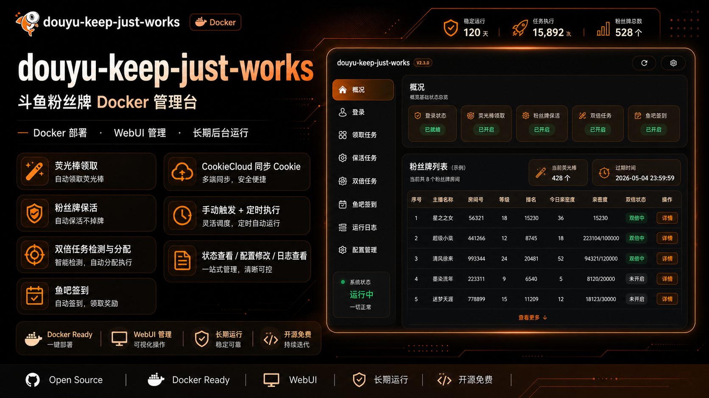

# douyu-keep-just-works

> 斗鱼粉丝牌 Docker 管理台

[Docker 部署](#docker-部署) · [镜像标签](#镜像标签) · [版本迭代](#版本迭代) · [参与贡献](#参与贡献) · [安全问题](#安全问题) · [致谢](#致谢)

## 简介



当前仓库主要维护 Docker WebUI，适合 NAS、家庭服务器和长期后台运行场景。

当前支持：

- 荧光棒领取
- 粉丝牌保活
- 双倍任务检测与分配
- 鱼吧签到
- CookieCloud 同步斗鱼相关 Cookie

## Docker 部署

默认部署使用 GitHub Workflow 发布到 Docker Hub 的镜像。

```yaml
services:
  douyu-keep-just-works:
    image: tophtab/douyu-keep-just-works:latest
    container_name: douyu-keep-just-works
    restart: unless-stopped
    ports:
      - '51417:51417'
    volumes:
      - ./config:/app/config
    environment:
      - TZ=Asia/Shanghai
      - WEB_PASSWORD=password
```

```bash
docker compose up -d
```

启动后访问 `http://localhost:51417`，输入 WebUI 密码后即可在页面中保存 Cookie、启用任务、查看日志和手动触发任务。

查看日志：

```bash
docker compose logs -f
```

## 镜像标签

- Docker Hub 发布的是多架构镜像，支持 `linux/amd64` 和 `linux/arm64`，适合常见 x86_64 服务器和 ARM64 NAS/家庭服务器
- 正式发布使用 `Vx.y.z` Git 标签触发，并发布完整 Docker 版本标签，例如 `2.1.0`，同时更新 `latest`
- `latest` 表示最新稳定发布；需要可复现部署时，建议固定到完整版本标签
- 默认分支构建只使用非正式发布标签，例如 `edge` 和 `sha-<shortsha>`
- 不发布 `2.1` 或 `2` 这类 major/minor 浮动别名

## 版本迭代

普通版本号迭代使用无提交、无标签的 npm version 脚本，方便先检查 `package.json` 和 `package-lock.json` 的变更：

```bash
npm run version:patch
npm run version:minor
npm run version:major
```

准备正式发布时，在干净工作区中使用 release 脚本；它们会按 npm version 的默认语义创建提交，并使用与现有 GitHub Workflow 匹配的 `V*.*.*` 标签：

```bash
npm run release:patch
npm run release:minor
npm run release:major
```

发布说明记录在 [CHANGELOG.md](./CHANGELOG.md)。

## 配置建议

- 推荐优先使用 CookieCloud，同步浏览器里斗鱼相关域的完整 Cookie 集
- 手填 Cookie 只作为兜底，适合临时修复登录态
- 如果鱼吧签到失败，先检查鱼吧 Cookie 是否仍包含鱼吧登录态，并确认主站 Cookie 仍包含 `acf_uid`、`acf_biz`、`acf_stk`、`acf_ct`、`acf_ltkid`
- 如果主站任务异常，优先检查主站 Cookie 是否仍包含 `acf_uid`、`dy_did`、`acf_stk`

## 参与贡献

当前维护重点是 Docker WebUI。提交 PR 前请先运行：

```bash
npm run lint
npm run type-check
npm run build:docker
npm test
```

更多本地开发、问题反馈和 PR 要求见 [CONTRIBUTING.md](./CONTRIBUTING.md)。

## 安全问题

请不要在公开 issue、截图或日志中粘贴斗鱼 Cookie、CookieCloud 凭据、WebUI 密码或原始配置文件。

漏洞报告和私密沟通方式见 [SECURITY.md](./SECURITY.md)。

## 许可证

本项目使用 MIT License，详见 [LICENSE](./LICENSE)。

## 声明

本项目仅供个人学习、技术研究与非商业性技术交流使用，仅提供代码与部署方式参考。

使用者应自行确认其使用行为符合目标平台规则及当地法律法规，作者不对因使用本项目产生的任何直接或间接后果负责。

## 致谢

本项目最初基于 Curtion 的相关实现演进而来，感谢原项目提供的思路与基础：

- https://github.com/Curtion/douyu-keep
- https://github.com/qianfeiqianlan/yuba-check-in
- https://github.com/qianjiachun/douyuEx
- 每日荧光棒领取的非浏览器模拟方案：https://nicelee.top/blog/2021/09/28/python-douyu-danmu/
- 感谢 LINUX DO 社区的交流与支持：https://linux.do/
